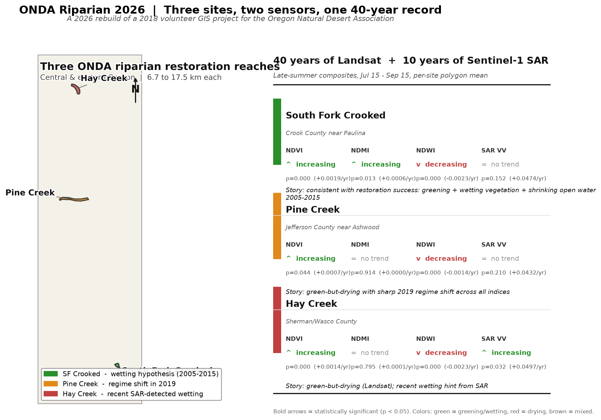

# onda-riparian-2026

> A 2026 revamp of a 2018 volunteer GIS project for the [Oregon Natural Desert Association](https://www.onda.org). Uses 40+ years of Landsat and 10 years of Sentinel-1 SAR to track vegetation and moisture change in three eastern Oregon riparian restoration reaches.



## TL;DR

- **Three ONDA restoration reaches** in eastern Oregon (Hay Creek, Pine Creek, South Fork Crooked River), 6.7 to 17.5 km² each.
- **Two independent satellites**: 42 years of Landsat surface reflectance (1984–2025) and 10 years of Sentinel-1 C-band SAR backscatter (2015–2024), pulled via Google Earth Engine.
- **Three different stories**, per site:
  - **South Fork Crooked** shows a signature *consistent with successful restoration* — vegetation greening + wetting + shrinking open water, transitioning 2005–2015. Needs ground truth to confirm.
  - **Pine Creek** shows a *sharp 2019 regime shift* across all indices. Cause unknown; could be fire, restoration, grazing change, or climate.
  - **Hay Creek** shows *long-term drying* in Landsat but *recent wetting* in SAR. Two-sensor disagreement is itself interesting.
- **All findings are hypothesis-generating**, not conclusive. Confirming any of them requires ONDA project dates and, ideally, a control drainage.

## Background

In spring 2018 I volunteered with ONDA's riparian restoration coordinator, Jefferson Jacobs, to build a Google Earth Engine tool that computed NDVI from NAIP imagery for three drainages where ONDA had done restoration work: **Hay Creek**, **Pine Creek**, and the **South Fork of the Crooked River**.

The premise was elegant: in eastern Oregon in late summer there is no rain, so any plant that stays green is tapping shallow groundwater. Map the green pixels in August, and you have mapped the functional groundwater footprint of a drainage. Do it every year, and you can watch groundwater expand or contract in response to restoration work.

The 2018 prototype was a JavaScript script in the Earth Engine Code Editor with polygons stored in Google Fusion Tables. The prototype worked. Then Fusion Tables shut down (December 2019) and I moved on. This repo is the 2026 rebuild.

## What changed in 2026

| 2018 | 2026 |
|---|---|
| NAIP, one growing season | Landsat 5/7/8/9 (1984–present) + Sentinel-2 (2015–present) |
| NDVI only | NDVI + NDMI + NDWI + Sentinel-1 SAR backscatter |
| Google Fusion Table sites | Real ONDA polygons committed to the repo |
| JavaScript in GEE editor | Python + `earthengine-api` + `geemap` + `pixi` |
| Screenshot deliverables | Reproducible notebooks + scripts + Streamlit dashboard |
| No trend testing | Mann-Kendall + Theil-Sen + PELT change-point detection |
| One-off analysis | GitHub repo, unit tests, CI, versioned outputs |

## Key findings

### South Fork Crooked River — the most interesting site

Every index goes the direction restoration would predict: NDVI up (p < 0.0001), NDMI up (p = 0.013), NDWI down (p < 0.0001). The change-point structure shows a decade-long transformation (NDWI shift 2005, NDVI shift 2010, NDWI shift 2015). That temporal pattern is consistent with beaver dam analog networks aging into the landscape and expanding the wet footprint gradually.

*Caveat*: SAR (2015–2024) does not independently confirm the wetting signal, because most of the change happened before Sentinel-1 launched. Without ONDA project dates, this remains suggestive rather than proven.

### Pine Creek — the 2019 regime shift

All three Landsat indices show a change point in 2019. That's not a slow trend — it's a step. Something specific happened in or around 2019 that pushed vegetation greener and open-water lower simultaneously. Only Jefferson knows what.

### Hay Creek — cross-sensor disagreement

Landsat says Hay Creek is drying (NDWI slope significantly negative). SAR says it's wetting (VV backscatter significantly positive over 2015–2024). The two-sensor disagreement is a real finding: whatever is going on at Hay Creek only started recently and involves change that optical sensors miss.

## Study sites

Three eastern Oregon riparian restoration reaches. Polygons exported from ONDA's own working files and stored in `data/sites/onda_study_sites_enriched.geojson`, which carries every trend statistic as a feature property (open in QGIS, GeoLibre, or any GIS tool to inspect).

| Site | Location | Area | Drainage system |
|---|---|---|---|
| Hay Creek | Sherman/Wasco County | 10.9 km² | John Day River tributary |
| Pine Creek | Jefferson County near Ashwood | 17.5 km² | Trout Creek → Deschutes |
| South Fork Crooked | Crook County near Paulina | 6.7 km² | SF Crooked River headwaters |

## Quickstart

Requires [pixi](https://pixi.sh) (`iwr -useb https://pixi.sh/install.ps1 | iex` on Windows).

```bash
git clone https://github.com/bdgroves/onda-riparian-2026.git
cd onda-riparian-2026
pixi install                       # ~5 min first time
pixi run auth                      # Earth Engine sign-in
```

Everything else is a `pixi run` task:

| Command | What it does |
|---|---|
| `pixi run lab` | Jupyter Lab in `notebooks/` |
| `pixi run python scripts/run_all_sites.py` | Regenerate the 42-year Landsat CSVs (~5 min) |
| `pixi run python scripts/run_all_sites_sar.py` | Regenerate the 10-year SAR CSVs (~3 min) |
| `pixi run python scripts/make_summary_figure.py` | Three-site grid + z-scored comparisons |
| `pixi run python scripts/make_sar_comparison.py` | NDMI vs SAR cross-sensor check |
| `pixi run python scripts/make_enriched_geojson.py` | Rebuild the enriched GeoJSON from live CSVs |
| `pixi run python scripts/make_hero_figure.py` | Rebuild this README's hero figure |
| `pixi run -e dev test` | Unit tests |

## Repo layout

```
onda-riparian-2026/
├── data/
│   ├── sites/                    # Study site polygons (committed)
│   │   ├── onda_study_sites.geojson           # raw
│   │   └── onda_study_sites_enriched.geojson  # with all trend stats baked in
│   ├── restoration/              # Restoration event log (needs ONDA input)
│   └── ancillary/                # Oregon boundary + other supporting layers
├── notebooks/                    # Jupytext-paired .py notebooks
│   ├── 01_site_setup.py          # site loading + sanity map
│   ├── 02_landsat_timeseries.py  # Landsat 1984-present pipeline
│   ├── 03_sentinel2_finescale.py # Sentinel-2 10m fine-scale (stub)
│   ├── 04_sar_moisture.py        # Sentinel-1 SAR (stub, superseded by scripts/)
│   └── 05_change_detection.py    # LandTrendr pixel-level (stub)
├── src/onda/                     # Reusable library
│   ├── sites.py                  # Site polygon loading
│   ├── composites.py             # Cloud-masked Landsat/S2/S1 composites
│   ├── indices.py                # NDVI, NDMI, NDWI, EVI, NBR
│   ├── trends.py                 # Mann-Kendall + Theil-Sen + PELT
│   ├── restoration.py            # Event annotation
│   └── viz.py                    # Plotting helpers
├── scripts/                      # Batch runners + figure generators
├── outputs/                      # Generated CSVs and figures (committed for browsing)
├── dashboard/                    # Streamlit app (opt-in)
├── docs/                         # Blog post draft, methods notes
└── tests/                        # Pytest suite (pure-python; runs on CI)
```

## Data sources

All free, all public, all API-accessible:

- **Landsat Collection 2 Level-2** (surface reflectance, 30 m, 1984–present) via Google Earth Engine
- **Sentinel-2 Level-2A** (surface reflectance, 10 m, 2015–present) via GEE
- **Sentinel-1 GRD** (C-band SAR, 10 m, 2014–present) via GEE
- **USGS NHDPlus HR** for stream centerlines (planned, not yet integrated)
- **US state boundaries** via PublicaMundi's `us-states.json` on GitHub (auto-fetched, cached in `data/ancillary/`)

## Limitations

Being honest about what this analysis can and cannot say:

- **No ground truth yet.** Without ONDA project dates and locations, every interpretation is a hypothesis. We know things changed; we cannot say why.
- **Polygon-mean averaging hides spatial detail.** SF Crooked is 6.7 km². If BDAs were installed on a 200-meter reach, their effect is diluted 30-to-1 in the polygon mean. Pixel-level analysis (notebook 05) is the next step.
- **No control drainage.** All three sites could be responding to regional climate rather than local restoration. Adding an unrestored control drainage in the same climate zone would let us make causal claims.
- **10-year SAR record is short.** Sentinel-1 doesn't cover the transformation window at SF Crooked (2005–2015). Independent confirmation of the pre-2015 story is not possible with current sensors.

## Roadmap

- [x] Repo scaffold + reproducible environment (pixi)
- [x] Site definitions from ONDA's real polygons
- [x] Landsat 1984-present pipeline + trend tests + change-point detection
- [x] Sentinel-1 SAR pipeline as independent moisture check
- [x] Enriched GeoJSON with all stats as properties
- [x] Publication-quality summary figures
- [x] Continuous integration
- [ ] Restoration event data from ONDA (blocking)
- [ ] Control drainage
- [ ] Pixel-level LandTrendr change detection (notebook 05)
- [ ] Sentinel-2 fine-scale (10m) confirmation of Landsat trends (notebook 03)
- [ ] GeoLibre interactive project (notebook 06)
- [ ] Field-report blog post at [brooksgroves.com](https://brooksgroves.com)

## License

MIT. Use it, extend it, fork it. If you use the analysis for ONDA or a similar organization, a note back to `brooks@brooksgroves.com` is appreciated.

## Credits

Original 2018 project: **Jefferson Jacobs** framed the science question and pointed at the drainages when he was ONDA's Riparian Restoration Coordinator; he is now their Riparian Restoration Manager. Everything here just implements his idea with 8 more years of Landsat data and a proper stack.

Study site polygons: exported from ONDA's own working files. Thanks to whoever maintained that layer.

Tooling: [`geemap`](https://geemap.org) and [`GeoLibre`](https://geolibre.app) by Qiusheng Wu, plus the Earth Engine team, and the Python geospatial community broadly.
